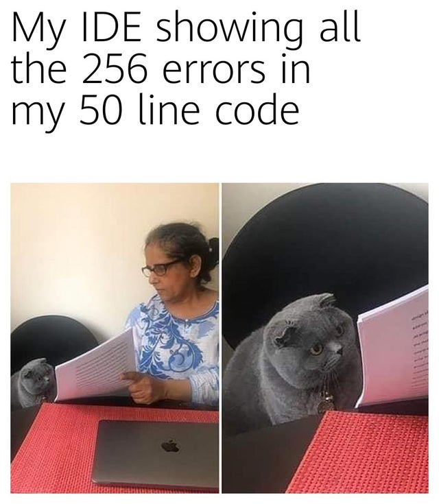
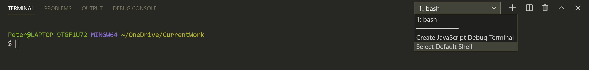
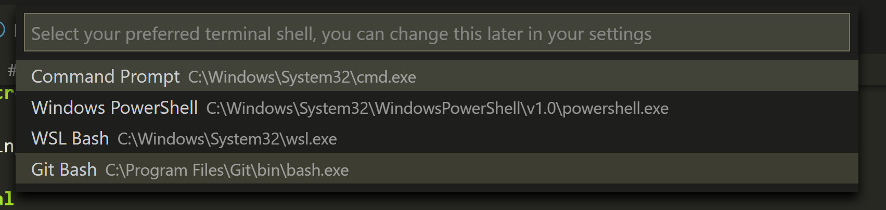
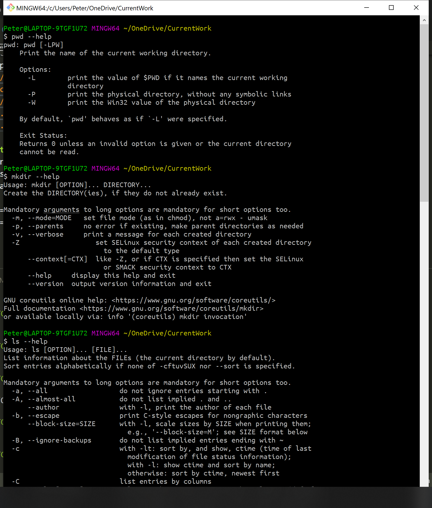
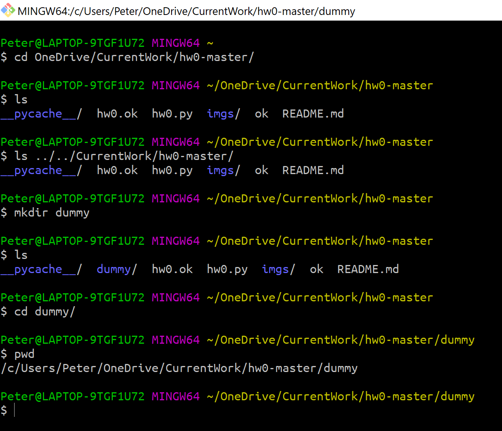
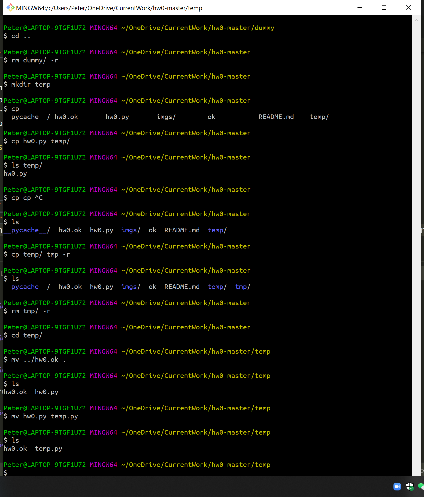
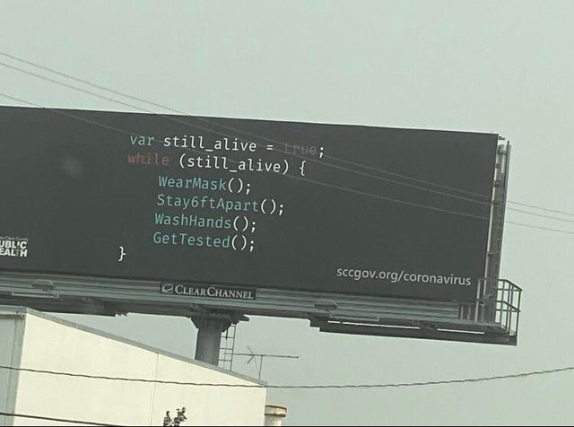

# Terms

- [`terminal`](https://en.wikipedia.org/wiki/Computer_terminal): Used to be a piece of hardware, now almost equivalent to `shell`.
- [`shell`](https://en.wikipedia.org/wiki/Shell_(computing)): Refers to interfaces to interact with your system. Command-line user interface(CLI) and graphical user interface(GUI).
  - [`sh`](https://en.wikipedia.org/wiki/Bourne_shell)
  - [`bash`](https://en.wikipedia.org/wiki/Bash_(Unix_shell)): Command language that almost everyone(Most Linux distributions, Mac OS before Catalina, Windows Subsystem for Linux) uses.
  - `zsh`: Default on Mac OS X Catalina([How to change default to bash](https://www.howtogeek.com/444596/how-to-change-the-default-shell-to-bash-in-macos-catalina/))
  - ......
- `IDE`: Puts everything(Coding, text editing, documentation, version control, terminal, extensions, etc.) together
  - VS Code
  - PyCharm
  - ......
- `Markdown`: A lightweight texting format that renders nice looking pages, file name ends with `.md`(This file is rendered with Markdown) :)

# VC Code usage

## Left panel

Navigate through files, searching, versions, debugging, extensions.

Useful extensions: Python & Markdown.

## Main screen

Text editing, previewing

## Terminal

On top, `Terminal -> New Terminal`.
We are mainly using bash, so on up right of your VS Code there is a drop box, if it doesn't say bash, choose `Select default shell` and change to bash. 

If you don't see a git bash, but you have your gitbash installed, put a path to it in there.

# Commands

Commands has the form `<command> [args*]`, most likely this is an option: `<command> --help`

## Prior knowledge

- Directory: In Windows(or some other systems) it's called folder.
- Path: a string that tells your system how to negavite through your file system.
  - Relative path: relative to current directory.
    - `.` is the current directory, `..` is the parent directory.
  - Absolute path: starts with `/`
  - HOME: `~`, the default location you will be when starting a shell. It's like Desktop in GUI's sense.
    - Windows: `~` = `/c/Users/<username>/`
    - Linux: `~` = `/home/<username>/`
    - Mac: I am not sure :)
  - Examples:
    - `~/OneDrive/CurrentWork`
    - `/c/Users/Peter/` (Don't use Windows' path `C:\Users\Peter` in bash, it's not recognized.)
    - `./hw0-master`
    - `../../CurrentWork`
    - `../hw0-master/././`

## Directories
`pwd`: Print the path of the current working directory.
`ls`: List information about the FILEs (the current directory by default).
`cd`: Change directory, if no argument specified, goes to HOME.
`mkdir`: Make directory.

## Files
- `rm`: Remove, add `-r` to remove a directory.
- `cp`: Copy, add `-r` to copy a directory.
- `mv`: Move. You can move a file to it's current location with a new name to rename, so there is no command for rename.

## Others

- `clear`: Clear your bash.
- `history`: Show your previous commands.
- `git`: Version control. `git clone` is basically downloading something, with few more extra things you don't need to worry about.
- `python3` / `python`
- `exit`: Quit current bash.

# Quick tips

- Use `Tab` to auto-fill your command. Doublt `Tab` to show all possible ways to fill it.
- `Ctrl + C` terminates current command, `Ctrl + Shift + C/V` is copy/paste.
- `Ctrl + R` to search previous commands.
- Use `left/right` to move cursor by a character, use `Ctrl + left/right` to move cursor by a word, **use `up/down` to show previous commands**.

# Conclusion

- Terminal(shell) is a command-line interface with your system, most of you use `bash`.
- VS Code is an IDE, not terminal. We demostrated certain usage of VS Code
- Use `<command> --help` to find help information.
- Serval commands: `pwd`, `ls`, `cd`, `mkdir`, `cp`, `mv`, etc...

