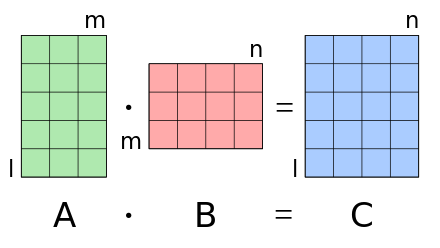

# Discussion 8

## Functional Programming
**Function as parameter**

In python, a function can be passed to another function as an argument.

```python
>>> def func_as_parameter(f, x):
...     return f(x)
...
>>> def say_hello(name):
...    return 'Hello ' + name + '!'
...
>>> func_as_parameter(say_hello, 'Haitian')
'Hello Haitian!'
```

A function is a **first-class** object in python, like an `int`, a `str` or a `list`. A function can be **assigned** to a variable or **passed** as an argument. The only difference between function and `int`/`str`/`list` is a function can be called by adding parentheses.

**Lambda function**

- Some functions may only be used as an argument for another function, so they do not have to have a name. 
- Some functions may be used to implement very simple algorithm.

**Lambda function** or **lambda expression** is a kind of **anonymous** functions in python.

```python
>>> f = lambda x: x + 1
>>> f(10)
11
>>> g = lambda x, y: x * y
>>> g(3, 5)
15
>>> def func_as_parameter(f, x):
...     return f(x)
...
>>> func_as_parameter(lambda x: sum(i for i in range(x)), 5)
10
```

Syntax of lambda function:
```python
lambda params... : function expression
```

Features of lambda function:
- **Anonymous**: lambda functions do not have to have a name.
- **First-class object**: lambda functions can be assigned to a variable or passed as an argument (like normal functions).

**Map&Recuce**

Map and reduce are two functions which take another function and a list as parameters. `map(f, l)` and `reduce(f, l, base)`.

- **Map**: given a list `l` and a function `f(x)`, **map** will "map" `l[i]` $\rightarrow$ `f(l[i])`. Map can also be implemented with list comprehension, so `map(f, l)` gives us a list `[f(i) for i in l]`.

- **Reduce**: given a list `l`, a function `f(x, y)` and a base `b`, 
```python
for i in l:
    b = f(b, i)
```
Then let the final `b` as the result of reduce.

## Set to Numbers: Recursion and Memorization
**Set definition of natural number**

The natural number set can be defined as:
- $0=\emptyset$, 
- $1=\{0\}=\{\emptyset\}$,
- $2=\{0, 1\}=\{\emptyset, \{\emptyset\}\}$,
- $3=\{0, 1, 2\}=\{\emptyset, \{\emptyset\}, \{\emptyset, \{\emptyset\}\}\}$, 
- ...
- $n=\{0, 1, 2, ..., n-1\}$.
- ...

Notice that 
- $n=\{0, 1, 2, ..., n-2, n-1\}$ and 
- $n-1=\{0, 1, 2, ..., n-2\}$,

We have $n=\{0, 1, 2, ..., n-2\}\cup\{n-1\}=n-1\cup\{n-1\}$. In python, we can use a tuple to denote a set in mathematics. And the formula between $n$ and $n-1$ can be implemented as
```python
>>> n_to_tuple(n) = tuple(list(n_to_tuple(n-1)).append(n_to_tuple(n-1)))
```
Since tuple is immutable in python, we have to converse it to list. This expression can be implemented with recursion.

**The way to accelerate recursion: memorization**

The computational overhead of recursion is dramaticly large. For example, if we use recursion to implement `sum_to_n(n)`, 
- `sum_to_n(n) = sum_to_n(n-1) + n`, so we have to compute `sum_to_n(n-1)`
- `sum_to_n(n-1) = sum_to_n(n-2) + (n-1)`, so we have to compute `sum_to_n(n-2)`, 
- `sum_to_n(n-2) = sum_to_n(n-3) + (n-2)`, so we have to compute `sum_to_n(n-3)`, 
- ...
- `sum_to_n(3) = sum_to_n(2) + 3`, so we have to compute `sum_to_n(2)`,
- `sum_to_n(2) = sum_to_n(1) + 2 = 1 + 2 = 3`, 
- then we use `sum_to_n(2)` to compute `sum_to_n(3)`,
- then we use `sum_to_n(3)` to compute `sum_to_n(4)`,
- ...

We have to call the function for n times. Meanwhile, we need a block of memory space to store temporary variables, such as `sum_to_n(n-1)` and `sum_to_n(n-2)`.

Can we store the outputs of a recursion function so we can directly use the previous outputs to compute the new result?

```python
output = [0]
def sum_to_n(n):
    if n < 0: return None
    if n > len(output): sum_to_n(n-1)
    if n == len(output): output.append(n + output[n-1]) # replace this line with any other recursion
    return output[n]
```

With memorization, we have another way to implement `n_to_tuple`. Recall the definition of n_to_tuple(n): $n=\{0, 1, 2, ..., n-2, n-1\}$. The `output` list in memorization is `[n_to_tuple(0), n_to_tuple(1), ...]`. So if we compute the `output` list until it contains `[n_to_tuple(0), n_to_tuple(1), ..., n_to_tuple(n-1)]`, we can get `n_to_tuple(n)` by
```python
>>> n_to_tuple(n) = tuple(output)
``` 

## Matrix Algebra
**Matrix and submatrix**

A matrix is a rectangular array or table of numbers.

$$
A=\left(\begin{array}{ccc}
1 & 3 & -5 \\
-2 & 10 & 6
\end{array}\right)
\begin{array}{l}
 \leftarrow\text{first row} \\
 \leftarrow\text{second row}
\end{array}
$$

Choosing a part of a matrix, we can get a submatrix. For example, the first and second column of $A$
$$
B=\left(\begin{array}{c}
1 \\
-2
\end{array}\right)
$$
is a submatrix of $A$, and is also a matrix.

**So the return type of Matrix.get() in Q9 is also a matrix.*

**Matrix addition**

Matrix addition is **element-wise** addition. So the sum of two matrices is computed by adding corresponding elements.

$$
\left(\begin{array}{ccc}
1 & 3 & -5 \\
-2 & 10 & 6
\end{array}\right) + \left(\begin{array}{ccc}
4 & -6 & 1 \\
3 & 5 & 4
\end{array}\right) = \left(\begin{array}{ccc}
1+4 & 3-6 & -5+1 \\
-2+3 & 10+5 & 6+4
\end{array}\right) = \left(\begin{array}{ccc}
5 & -3 & -4 \\
1 & 15 & 10
\end{array}\right)
$$

**Matrix mutiplication**: https://en.wikipedia.org/wiki/Matrix_multiplication



$$A=\begin{pmatrix}
 a_{11} & a_{12} & \cdots & a_{1n} \\
 a_{21} & a_{22} & \cdots & a_{2n} \\
\vdots & \vdots & \ddots & \vdots \\
 a_{m1} & a_{m2} & \cdots & a_{mn} \\
\end{pmatrix},\quad B=\begin{pmatrix}
 b_{11} & b_{12} & \cdots & b_{1p} \\
 b_{21} & b_{22} & \cdots & b_{2p} \\
\vdots & \vdots & \ddots & \vdots \\
 b_{n1} & b_{n2} & \cdots & b_{np} \\
\end{pmatrix}$$

and the product of $A$ and $B$ is 
$$
\mathbf{C}=\begin{pmatrix}
 c_{11} & c_{12} & \cdots & c_{1p} \\
 c_{21} & c_{22} & \cdots & c_{2p} \\
\vdots & \vdots & \ddots & \vdots \\
 c_{m1} & c_{m2} & \cdots & c_{mp} \\
\end{pmatrix}
$$

where $c_{ij} = a_{i1}b_{1j} + a_{i2}b_{2j} +\cdots + a_{in}b_{nj}= \sum_{k=1}^n a_{ik}b_{kj}$.

$$\begin{pmatrix}
 1 & 3 & 4 \\
 -2 & 4 & 1 \\
\end{pmatrix}\cdot \begin{pmatrix}
 3 & 2 \\
 -1 & 4 \\
 2 & 1 \\
\end{pmatrix} = \begin{pmatrix}
1\cdot 3 + 3\cdot(-1) + 4\cdot 2 & 1\cdot2 + 3\cdot4 + 4\cdot1 \\
(-2)\cdot3 + 4\cdot(-1) + 1\cdot2 & (-2)\cdot2 + 4\cdot4 + 1\cdot1 \\
\end{pmatrix} = \begin{pmatrix}
    8 & 18 \\
    -8 & 13 \\
\end{pmatrix}
$$

**Matrix in python**

In python, we can use a **list of list** to annotate a matrix
```python
a = [[1, 3, -5], [-2, 10, 6]]
b = [[4, -6, 1], [3, 5, 4]]
m = [[1, 3, 4], [-2, 4, 1]]
n = [[3, 2], [-1, 4], [2, 1]]
```

And compute the sum and product of matrices
```python
>>> a_plus_b = [[a[i][j] + b[i][j] for j in range(len(a[0]))] for i in range(len(a))]
>>> m_times_n = [[sum(m[i][k] * n[k][j] for k in range(len(m[0]))) for j in range(len(n[0]))] for i in range(len(m))]
```